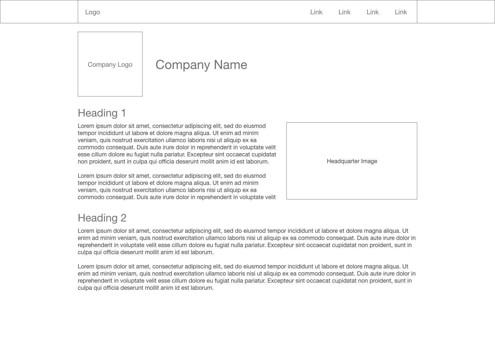
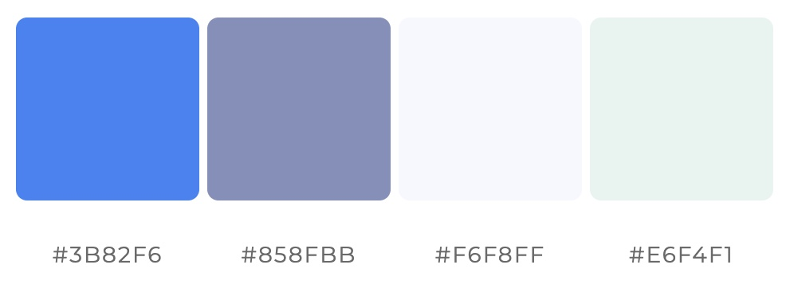

# Project 4: Top Tech Companies
> Visual Design
- Aman Shrestha : Information Architect
- Duncan Grubbs : Visual Designer  

## Layouts

### Homepage
As suggested by our information architecture, we will have a slideshow of images
on the homepage. To achieve this, we will be using a modified z-layout, in which
the call to action in the terminal area will change depending on the company
that is currently displayed.

Our logo/title will be in the primary optical area, leading users to our
navigation links in the strong fallow area. We will include each companies logo
in the weak fallow area, embedded over an image of their headquarters which will
span the entire width of the container.

### Company Pages
Sticking with a pattern we know, and a pattern that I think suits straightforward, professional content, we will use a modified F-pattern layout for each of the company pages.
This will allow users to quickly browse through a company page and extract key deatils without having to spend too much time.

I think that an F-pattern layout combined with a strong information architecture can create an incredibbly simple, yet concise and consistent website. This is exactly what we are shooting for when trying to showcase and compare the top tech companies.

*Below is a rough layout of a company page:*

## Color Pallet
I wanted to keep the color pallet modern and simple. [TailwindCSS](https://tailwindcss.com/docs/customizing-colors#curating-colors) is a CSS library that has very professional yet fun colors. This is exactly the combination of feelings that tech companies exude, and so I took the seed blue color from TailwindCSS are then used [My Color Space](https://mycolor.space/) to generate a pallet that wasn't too overwhelming. The idea of this website is to showcase tech companies, so I didn't want to distract users with bright, dramatic colors.

Another reason for keeping the pallet simple was that I didn't want to bias it heavily towards one company. I also stayed away from 'material design' colors so as to not bias it towards Google.

## Typography
In terms of typography, tech companies often have a very slick, modern brand, and I want to reflect that in the design
of our website. For this reason, I looked first at san-serif fonts, as they are considered more modern. I also wanted to create 
a friendly, uplifting energy on our site to match tech company's promotion. I settled on using
[Source Sans Pro](https://fonts.google.com/specimen/Source+Sans+Pro) as the primary text typeface. Then following recommendations from
Google Fonts and trying to keep things as simple as possible, I decided to use [Roboto](https://fonts.google.com/specimen/Roboto)
as the title and heading typeface. Unfortunately, Roboto is Google's typeface, and thus will create some bias towards Google in our design. That being said, I have seen both of these fonts used by numberous large tech companies, and they are hard
to match when it comes to straightfoward, warm, modern fonts.

### Source Sans Pro

### Roboto

These two typefaces are quite similar, so to avoid a lack of **contrast** between headings and paragraph text, we will leverage font weight and size.
